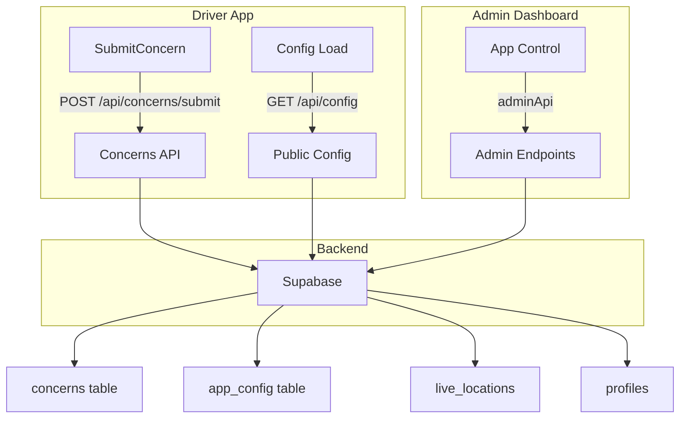
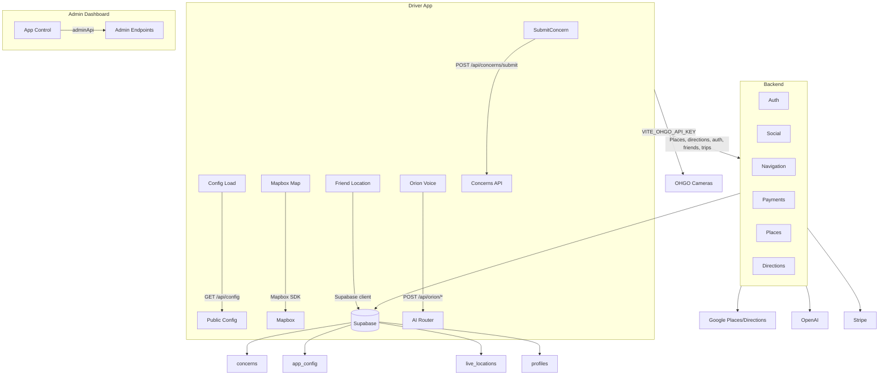

# SnapRoad Architecture & Deployment Audit

**Document version:** 2.1  
**Last updated:** March 2026  
**Purpose:** Single reference for architecture, Add Friends / Location Sharing configuration, all data flows, component wiring, and pre-deployment audit of every API and endpoint.

---

## 0. Deployment Readiness – Executive Summary

| System / Area | Status | Connected? | Blockers / Gaps |
| ------------- | ------ | ---------- | ---------------- |
| **Supabase (DB + Realtime)** | ✅ Primary datastore | Yes – concerns, app_config, live_locations, profiles, offers, trips, incidents | Friends still mock-only; ensure all SQL migrations (including `004_friend_locations.sql`, `005_concerns_app_config.sql`) are applied |
| **Friends & Location Sharing** | ⚠️ Mixed | Location uses Supabase live_locations; friends list is mock | Wire `/api/friends/*` to Supabase `friendships` + `get_current_user`; gate client features on `friend_tracking_enabled` |
| **Config Flags (`app_config`)** | ⚠️ Partial | Yes – `/api/config` and `/api/admin/config` | Driver App reads `maintenance_mode`, `announcement_banner`, `gems_multiplier` but **not** `friend_tracking_enabled`, `orion_enabled`, `ohgo_cameras_enabled` |
| **Stripe (Payments)** | ⚠️ Partial | Yes – checkout works | Webhooks do not update Supabase profiles (plan / is_premium); two webhook URLs exist (`/api/payments/webhook/stripe`, `/api/webhooks/stripe`) – choose one and persist plan state |
| **OpenAI (Orion, Photo)** | ✅ Connected | Yes – ai router → OpenAI | No admin health check; optional but recommended for launch |
| **Mapbox (Maps)** | ✅ Connected | Frontend only | Requires `VITE_MAPBOX_TOKEN`; no backend dependency |
| **Google Maps / Places** | ✅ Connected | Backend places/directions | Ensure `GOOGLE_PLACES_API_KEY` or `GOOGLE_MAPS_API_KEY` set in backend `.env`; admin health currently reports only `google_maps_configured` |
| **OHGO Cameras** | ⚠️ Frontend-only | Frontend direct → publicapi.ohgo.com | Controlled in admin via `ohgo_cameras_enabled` but Driver App does not yet gate camera layer on this flag |
| **Admin Health Dashboard** | ⚠️ Placeholder | Yes – `/api/admin/health` | Only API + DB checks are real; Google/OHGO/OpenAI health are `"unknown"` until implemented |
| **OpenAI (Orion AI)** | ✅ Connected | Yes – Orion coach + photo analysis use OPENAI_API_KEY | Admin Architecture tab and health show OpenAI; Orion uses orion_coach.py + OPENAI_API_KEY. |

---

## 1. How Add Friends and Location Sharing Are Configured

### 1.1 Add Friends – Current Behavior

| Layer | What Exists | How It Works |
|-------|-------------|--------------|
| **Backend** | `routes/social.py` | All friend endpoints use **in-memory mock data**: `users_db` and `current_user_id` from `services/mock_data.py`. No JWT/auth; `_get_uid()` returns a fixed mock user id. |
| **Endpoints** | `GET /api/friends`, `GET /api/friends/search`, `POST /api/friends/add`, `DELETE /api/friends/{friend_id}`, `GET /api/friends/list`, `GET /api/friends/requests`, `POST /api/friends/accept` | Read/write to mock dicts only. Data is lost on server restart. |
| **Frontend** | `FriendsHub.tsx`, `DriverApp` | Calls `/api/friends/search`, `/api/friends/add`, `/api/friends/{id}` (DELETE). Gets friend list from `/api/friends/list` for location sharing. |
| **Database** | `sql/004_friend_locations.sql` | Defines **`friendships`** table (user_id_1, user_id_2, status). Table exists in migration but **backend never uses it**; backend still uses mock. |

**Summary:** Add-friend flows are **not connected to Supabase**. Friend list is mock-only. To ship production:

1. Switch `social.py` to use **`get_current_user`** (JWT) instead of `current_user_id`.
2. Implement Supabase reads/writes for **friendships** (and optionally a **profiles** lookup for names). Use `sb_*` helpers or direct Supabase client in a new service layer for friends.
3. Keep the same API contract so the frontend keeps calling `/api/friends/*`.

### 1.2 Location Sharing – Current Behavior

| Layer | What Exists | How It Works |
|-------|-------------|--------------|
| **Database** | **`live_locations`** (Supabase) | Columns: user_id, lat, lng, heading, speed_mph, is_navigating, destination_name, last_updated, is_sharing. Realtime enabled. |
| **Backend** | `POST /api/friends/location/update`, `PUT /api/friends/location/sharing` | When `SUPABASE_URL` and `SUPABASE_SECRET_KEY` are set, upsert/update **live_locations**. Still uses mock `_get_uid()` for user_id. |
| **Frontend** | `lib/friendLocation.ts` | Uses **Supabase client** (VITE_SUPABASE_URL, VITE_SUPABASE_ANON_KEY): **updateMyLocation()** upserts current user’s row; **subscribeFriendLocations(friendIds, onUpdate)** subscribes to Realtime on `live_locations` filtered by user_id; **getFriendLocations()** one-time fetch. Uses **friend_locations** view for name/avatar. |
| **Driver App** | `DriverApp/index.tsx` | Fetches friend IDs from **GET /api/friends/list** (mock). Calls **updateMyLocation()** when position/navigation changes; calls **subscribeFriendLocations()** and renders **FriendMarkers**. Toggle “Share location with friends” sets **isSharingLocation** and backend **PUT /api/friends/location/sharing** (and frontend could stop calling updateMyLocation when off). |

So: **location storage and real-time updates are Supabase-backed**; the only missing piece is that **friend list** comes from mock, so “who can see me” is still from in-memory data.

### 1.3 Global Kill Switch – friend_tracking_enabled

- **Admin:** App Control → Controls has **Friend Tracking** toggle. It writes to **`app_config.friend_tracking_enabled`** via **POST /api/admin/config**.
- **Driver App:** On mount it loads **GET /api/config** and applies **maintenance_mode**, **announcement_banner**, **gems_multiplier**. It does **not** read **friend_tracking_enabled** (or **orion_enabled** / **ohgo_cameras_enabled**).
- **Gap:** Toggling “Friend Tracking” off in admin does not disable or hide friend/location features in the app. To make the kill switch effective:
  - In the same `useEffect` that loads `/api/config`, set e.g. `setFriendTrackingEnabled(!!cfg.friend_tracking_enabled)`.
  - When `friend_tracking_enabled` is false: do not call **updateMyLocation** or **subscribeFriendLocations**; hide the “Share location with friends” toggle and FriendMarkers (or show “disabled by admin”).

### 1.4 Summary Table

| Concern | Backend | Frontend | Persistence | Config flag |
|--------|---------|----------|-------------|-------------|
| Add/remove friends | `/api/friends/*` (mock) | Uses API | **Mock only** | — |
| Live location write | `POST /api/friends/location/update` (Supabase when configured) | `friendLocation.updateMyLocation` (Supabase) | **Supabase live_locations** | — |
| Friend locations read | — | `subscribeFriendLocations` / `getFriendLocations` (Supabase) | **Supabase + Realtime** | **friend_tracking_enabled** (in app_config; **not yet applied in Driver App**) |

---

## 2. Architecture Overview and Diagram

SnapRoad has three main surfaces and one central data layer:

1. **Driver App** (React/Vite) – Map (Mapbox), navigation, rewards, profile, concerns, config-driven UI, friends/location, Orion (AI).
2. **Admin Dashboard** (React) – Stats, concerns, users, live map placeholder, architecture view, health, app config (Controls), offers, partners, etc.
3. **Backend** (FastAPI) – REST API, auth, proxies to external APIs, persistence via Supabase and in-memory mocks.

**External systems:** Supabase (DB, optional Auth, Realtime), Stripe, OpenAI (Orion coach + photo analysis), OHGO, Mapbox, Google (Places/Directions), Apple MapKit (optional).

The canonical architecture diagrams are the Mermaid diagrams below. You can also export them to a PNG (for slides or other docs) as `snaproad_architecture_overview.png` if desired.

### 2.1 Architecture Diagram (Mermaid)



### 2.2 Extended Architecture (All Major Flows)



### 2.3 Friends + Location Sharing Flow

```mermaid
flowchart TB
  subgraph driver[Driver App]
    FriendsUI[FriendsHub / Settings]
    FriendApiCalls[Calls /api/friends/*]
    FriendLocationsState[friendLocation.ts]
  end

  subgraph backend[Backend Social Router]
    FriendsApi[/GET/POST /api/friends/* (mock today)/]
    LocationApi[/POST /api/friends/location/update \n PUT /api/friends/location/sharing/]
  end

  subgraph supabase[Supabase]
    FriendshipsTbl[(friendships table)]
    LiveLocations[(live_locations table)]
    FriendLocationsView[(friend_locations view)]
  end

  FriendsUI --> FriendApiCalls
  FriendApiCalls --> FriendsApi
  FriendLocationsState -->|updateMyLocation()| LiveLocations
  FriendLocationsState -->|subscribeFriendLocations()| LiveLocations
  LocationApi --> LiveLocations
  LiveLocations --> FriendLocationsView

  classDef note fill:none,stroke:none,color:#999;
```

**Today:** `FriendsApi` uses in-memory mock data (`users_db`, `current_user_id`) and never touches `friendships`. `LocationApi`, `updateMyLocation()`, and `subscribeFriendLocations()` write/read `live_locations`. **Goal for production:** point `FriendsApi` at Supabase `friendships` keyed by JWT user_id and let `friend_locations` view combine friendships + live_locations for authorized reads.

---

## 3. Data Flows – Explainer (Each Component and How It’s Wired)

### 3.1 User Submits a Concern

1. User opens **Report an Issue** in Driver App (Profile → Settings).
2. **SubmitConcern** collects category, severity, title, description, and device context.
3. Frontend calls **POST /api/concerns/submit** (with auth token). Backend **concerns** router uses **get_current_user**, then **sb_create_concern** to write to Supabase **concerns** table.
4. Admin sees the concern in **App Control → Concerns** and can update status via **POST /api/admin/concerns/:id/status**.

**Wiring:** SubmitConcern → api.post → Concerns API → Supabase concerns.

### 3.2 Driver App Loads Remote Config

1. On mount, Driver App calls **GET /api/config** (no auth). **config_public** router returns **app_config** (e.g. maintenance_mode, announcement_banner, gems_multiplier).
2. App sets state: maintenance overlay, announcement banner, gems multiplier. **Not yet:** friend_tracking_enabled, orion_enabled, ohgo_cameras_enabled are not read; they should be to make admin toggles effective.

**Wiring:** Config Load → api.get('/api/config') → config_public → sb_get_app_config → Supabase app_config.

### 3.3 Friend Location Sharing (Real Time)

1. Driver App gets friend IDs from **GET /api/friends/list** (currently mock).
2. **friendLocation.ts** subscribes to Supabase Realtime on **live_locations** for those user_ids; **getFriendLocations** for initial fetch; **updateMyLocation** for current user writes.
3. **FriendMarkers** re-renders from **friendLocations** state. Backend **POST /api/friends/location/update** can also write to **live_locations** when Supabase is configured.

**Wiring:** Driver App → /api/friends/list (mock) → friendIds → subscribeFriendLocations (Supabase) + updateMyLocation (Supabase). Backend location/update → Supabase live_locations.

### 3.4 Navigation and Map

- **Mapbox:** Frontend uses **VITE_MAPBOX_TOKEN** (MapboxContext, MapboxMapSnapRoad, mapboxDirections). Map and vector tiles and optional routing are client-side.
- **Places:** Backend **GET /api/places/autocomplete**, **GET /api/places/details/:id** proxy to Google Places API (GOOGLE_PLACES_API_KEY or GOOGLE_MAPS_API_KEY).
- **Directions:** Backend **GET /api/directions** proxies Google Directions; frontend may also use Mapbox Directions.
- **OHGO:** Frontend fetches cameras from **publicapi.ohgo.com** with **VITE_OHGO_API_KEY**. Admin can toggle **ohgo_cameras_enabled** in app_config; Driver App does not yet gate the camera layer on this flag.

### 3.5 Orion (AI) and OpenAI

- Driver App sends chat/streaming to backend **POST /api/orion/chat** or **/api/orion/completions** (stream). **ai** router uses **orion_coach.py** (OpenAI SDK).
- Backend uses **OPENAI_API_KEY** and **OPENAI_MODEL**. **orion_enabled** in app_config is not yet read by the Driver App.

### 3.6 Payments and Stripe

- Driver App calls **GET /api/payments/plans** and **POST /api/payments/checkout/session** (payments router). Backend uses **STRIPE_SECRET_KEY** to create a Stripe Checkout session.
- Stripe sends webhooks to **POST /api/payments/webhook/stripe** (payments.py) or **POST /api/webhooks/stripe** (webhooks.py). **STRIPE_WEBHOOK_SECRET** must be set. Handler should update user plan/entitlements (e.g. **profiles** in Supabase) on `checkout.session.completed`; currently payments.py uses an in-memory **payment_transactions** dict and does not persist to Supabase.

---

## 4. Component and Wiring Summary

| Component | Role | Wired to |
|-----------|------|----------|
| **SubmitConcern** | User feedback form | POST /api/concerns/submit → Supabase concerns |
| **Config Load** | Remote app config | GET /api/config → Supabase app_config |
| **AppControl** | Admin panel | adminApi → /api/admin/* (stats, concerns, live-users, health, config) |
| **friendLocation.ts** | Live location read/write | Supabase client → live_locations, Realtime |
| **Social (friends)** | Add/remove friends, list | Mock only; not Supabase |
| **MapboxContext / MapboxMapSnapRoad** | Map and routing | VITE_MAPBOX_TOKEN, Mapbox SDK |
| **Orion (AI)** | Chat/voice | Backend /api/orion/* → OpenAI (orion_coach.py) |
| **Places** | Search/autocomplete | Backend /api/places/* → Google Places |
| **Directions** | Route geometry | Backend /api/directions (Google) and/or Mapbox on frontend |
| **Payments** | Plans & checkout | Backend /api/payments/* → Stripe |
| **OHGO** | Traffic cameras | Frontend direct → publicapi.ohgo.com (VITE_OHGO_API_KEY) |

---

## 5. Full Endpoint Audit – What’s Connected and What’s Not

### 5.1 Backend Routers and Key Endpoints (All Mounted in main.py)

| Router | Prefix | Key endpoints | Connected to |
|--------|--------|----------------|--------------|
| auth | /api/auth | POST signup, POST login | Supabase (when configured) or mock |
| users | /api | /user/profile, /user/car, /skins, /family/group, /settings/*, /notifications, etc. | Supabase / mock |
| social | /api | /friends*, /friends/location/update, /friends/location/sharing, /family/members, /reports, /incidents | **Friends: mock only.** Location update: Supabase when configured. |
| navigation | /api | /locations, /routes, /navigation/start|stop, /map/search, /map/traffic | Mock + optional Supabase |
| trips | /api | /trips/history, /trips/complete-with-safety, /fuel/* | Supabase / mock |
| offers | /api | /offers, /offers/:id/redeem, /offers/nearby | Supabase |
| gamification | /api | /badges, /challenges, /gems/*, /leaderboard, /driving-score | Supabase / mock |
| directions | /api | GET /directions | **Google** (GOOGLE_* key) |
| places | /api/places | /autocomplete, /details/:id, /nearby, /photo | **Google** Places |
| incidents | /api/incidents | POST /report, GET /nearby, POST /:id/upvote|downvote | Supabase / mock |
| ai | /api | POST /orion/chat, /orion/completions, /photo/analyze | **OpenAI** (OPENAI_API_KEY) |
| concerns | /api | POST /concerns/submit | **Supabase** concerns + auth |
| config_public | /api | GET /config | **Supabase** app_config |
| admin | /api | /admin/stats, /admin/concerns, /admin/concerns/:id/status, /admin/live-users, /admin/health, /admin/config, POST /admin/config, plus offers, partners, users, etc. | **Supabase** (and health placeholders) |
| mapkit | /api | GET /mapkit/token | Apple MapKit (when configured) |
| payments | /api/payments | GET /plans, POST /checkout/session, GET /checkout/status/:id, POST /webhook/stripe, GET /transactions | **Stripe**; webhook does **not** update Supabase profiles |
| webhooks | (none) | POST /api/webhooks/stripe | Stripe (alternate webhook path) |
| partners | /api | Many /partner/*, /partner/v2/*, Stripe subscribe/boost/credits | Stripe, Supabase |
| osm | /api | GET /osm/features | OSM/external |

### 5.2 Endpoints Not Connected or Missing

| Item | Status | What’s missing |
|------|--------|-----------------|
| **Friends list / add / remove** | Not connected to DB | Backend uses mock only. Supabase **friendships** table exists but is unused. Need to wire social.py to Supabase + **get_current_user**. |
| **Friend list for location sharing** | Mock | Same as above; /api/friends/list returns mock data, so “who can see my location” is not persisted. |
| **Auth on social routes** | Missing | /api/friends/* and /api/friends/location/update use mock _get_uid(). Need JWT (get_current_user) and scope by real user_id. |
| **Stripe webhook → user plan** | Incomplete | payments.py webhook updates in-memory payment_transactions; does **not** update Supabase **profiles** (e.g. is_premium, plan). Need to persist subscription state to DB. |
| **Single Stripe webhook URL** | Duplicate | Two routes: POST /api/webhooks/stripe (webhooks.py) and POST /api/payments/webhook/stripe (payments.py). Pick one and configure that URL in Stripe dashboard. |
| **GET /api/config → feature flags in app** | Partial | Driver App reads maintenance_mode, announcement_banner, gems_multiplier. Does **not** read friend_tracking_enabled, orion_enabled, ohgo_cameras_enabled; admin toggles have no effect in app. |
| **Admin health checks** | Implemented | GET /api/admin/health checks API, Supabase DB, Google Maps, OHGO, OpenAI, and Supabase Realtime with real HTTP calls and latency. |
| **OpenAI** | Integrated | Orion coach (orion_coach.py) and photo analysis use OPENAI_API_KEY; health check calls api.openai.com/v1/models. |

### 5.3 Frontend → Backend Call Summary

- **Driver App** uses **api** (services/api.ts) with **VITE_API_URL** / **VITE_BACKEND_URL** for: auth, user profile, locations, routes, navigation, trips, offers, challenges, badges, incidents, concerns submit, **GET /api/config**, payments (plans, checkout), family, friends (list, add, remove, location/update, location/sharing).
- **Admin Dashboard** uses **adminApi** (services/adminApi.ts) with **VITE_BACKEND_URL** for all /api/admin/* and partner/boost endpoints.
- **Places/directions** are called by Driver App via api to backend; backend proxies to Google.
- **OHGO** is called **directly from the frontend** (publicapi.ohgo.com); no backend proxy.
- **Mapbox** is client-only (VITE_MAPBOX_TOKEN).
- **Supabase** is used **directly from the frontend** in friendLocation.ts (VITE_SUPABASE_URL, VITE_SUPABASE_ANON_KEY) for live_locations and Realtime.

---

## 6. APIs and External Services – Full Audit

| API / Service | Role | Backend env | Frontend env | Connected? | Notes |
|---------------|------|-------------|--------------|------------|-------|
| **Supabase** | DB, Realtime, optional Auth | SUPABASE_URL, SUPABASE_SECRET_KEY | VITE_SUPABASE_URL, VITE_SUPABASE_ANON_KEY | Yes | Used for concerns, app_config, live_locations, profiles, offers, etc. Friends still mock. Run migrations 004, 005. |
| **Stripe** | Payments, subscriptions, checkout | STRIPE_SECRET_KEY, STRIPE_WEBHOOK_SECRET | VITE_STRIPE_PUBLISHABLE_KEY | Yes | Checkout works. Webhook does not update Supabase; two webhook paths exist. |
| **OpenAI** | Orion coach, photo analysis | OPENAI_API_KEY, OPENAI_MODEL, OPENAI_VISION_MODEL | VITE_OPENAI_API_KEY (optional fallback) | Yes | Used by orion_coach.py and photo_analysis.py. No health check in admin. |
| **OHGO** | Traffic cameras (Ohio) | Not required | VITE_OHGO_API_KEY | Frontend only | Direct fetch from publicapi.ohgo.com. Backend health shows "unknown". Gate on ohgo_cameras_enabled in app when implemented. |
| **Mapbox** | Map tiles, optional directions | — | VITE_MAPBOX_TOKEN | Frontend only | MapboxContext, MapboxMapSnapRoad, mapboxDirections. No backend usage. |
| **Google** | Places, Directions | GOOGLE_PLACES_API_KEY or GOOGLE_MAPS_API_KEY | Optional (e.g. VITE_GOOGLE_*) | Yes (backend) | places.py, directions.py. Env-check reports google_maps_configured. |
| **Apple MapKit** | Optional map token | MAPKIT_KEY_ID, MAPKIT_TEAM_ID, MAPKIT_PRIVATE_KEY_PATH | — | Optional | GET /api/mapkit/token. |
| **OpenAI** | Orion coach + photo analysis | OPENAI_API_KEY | gpt-4o / gpt-4o-mini | Yes | Orion and photo analysis; health check in admin. |

---

## 7. What’s Left for Deployment – Checklist

### 7.1 Must-Have

1. **Friends persistence:** Replace mock friends in social.py with Supabase (friendships table + RLS) and **get_current_user** for all /api/friends/* and location endpoints.
2. **Config flags in Driver App:** Read **friend_tracking_enabled**, **orion_enabled**, and optionally **ohgo_cameras_enabled** from GET /api/config and gate features so admin toggles take effect.
3. **Stripe webhook:** One canonical URL (e.g. /api/payments/webhook/stripe); verify with STRIPE_WEBHOOK_SECRET; on checkout.session.completed update **profiles** (or equivalent) in Supabase with plan/entitlements.
4. **Auth on social routes:** Use **get_current_user** (or equivalent) on all /api/friends/* and /api/friends/location/update so requests are scoped to the authenticated user.

### 7.2 Should-Have

5. **Health checks:** Implement real checks in GET /api/admin/health for Google, OHGO (if used), and OpenAI (and optionally Mapbox if ever server-side).
6. **Push notifications:** No FCM/APNs described; add if trip/offer/friend alerts are required.
7. **Error monitoring:** e.g. Sentry for backend and frontend.
8. **Analytics:** Product/usage analytics if needed beyond admin stats.

### 7.3 Nice-to-Have

9. **File storage:** User avatars or concern screenshots (Supabase Storage or S3).
10. **Rate limiting:** On auth and public endpoints.
11. **Audit:** Use app_config.updated_by and audit log consistently for admin config and concern status changes.

---

## 8. Document Summary

- **Add friends:** Implemented via /api/friends/*; **mock only**. Wire to Supabase **friendships** and real auth for production.
- **Location sharing:** Uses Supabase **live_locations** and Realtime; backend can write via POST /api/friends/location/update. Global toggle **friend_tracking_enabled** exists in **app_config** but is **not** read by the Driver App; wire it to disable/hide friend location features when off.
- **Architecture:** Driver App, Admin Dashboard, and Backend interact with Supabase and external APIs (Stripe, OpenAI, OHGO, Mapbox, Google, MapKit) as in the diagrams and flow descriptions.
- **APIs:** Supabase, Stripe, OpenAI (Orion + photo), OHGO (frontend), Mapbox (frontend), Google (backend) are connected. Config-driven toggles (friend_tracking_enabled, orion_enabled, ohgo_cameras_enabled) and a single Stripe webhook that updates user entitlements in Supabase are implemented.

Use this document as the single reference for architecture, Add Friends / Location Sharing configuration, flows, and deployment audit; update it as you connect friends to Supabase, add config gating, and finalize webhooks and health checks.
